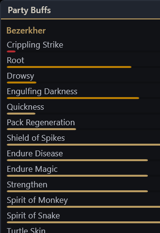

# EQL Buff Bars

A buff and DoT timer overlay for **EverQuest Legends**. It reads the log file the game already writes to disk, works out which spells landed on whom, and floats small always-on-top panels over your game showing live countdown bars for buffs across your **party and raid** and DoTs/debuffs on the mobs you fight. Your character's log records every nearby spell cast and every landing message - that alone is enough to reconstruct who has what, so groupmates on their own computers show up without any setup on their end. It never touches the game process itself - no memory reading, no injection, no network traffic.



## Features

- **Party and raid buff timers.** Every party member your character observes gets a panel - buffs land on them in your log via cast and landing messages, and wear-off/death/zone events correct the timers. Alts you play from this computer are picked up automatically whenever their log file appears. Buffs are sorted soonest-to-expire first, with bars turning amber under a minute and red under twenty seconds.
- **Debuff alarms.** A detrimental effect on a party member (a DoT, a snare, a malo) is the most actionable thing the overlay can show you, so it gets a bright red row sorted to the very top of that character's panel.
- **Vital buffs pinned.** Heal-over-time, regen, haste, and damage shield effects are detected from the client's own spell data (not a hand-maintained list), pinned above ordinary buffs, and tinted cyan so a dropped haste or HoT is impossible to miss.
- **Quick Buffs aggregate row.** The long-duration buff package from the Quick Buff AA can be dozens of individual icons. By default they collapse into a single row: `Quick Buffs (14) - cd 3:40` - showing how many are up, when the first one expires, and a live countdown on the AA cooldown itself.
- **DoT panel.** A separate window tracks detrimental timers on mobs, per caster - so in a group you can see your dots and everyone else's, labeled with who cast them. DoT ticks in the log act as heartbeats, so a timer that keeps ticking past its expected end gets extended instead of vanishing early.
- **Enemy Buffs panel (optional, off by default).** Shows *beneficial* effects on enemies - useful intel for dispelling and for knowing when a mob's damage shield or rune is still up.
- **Click-through overlays.** In normal operation the windows ignore the mouse entirely - clicks go straight through to the game. A tray-menu edit mode lets you drag and resize each panel, then locks them back down.
- **Dark theme.** Translucent dark panels with gold accent bars, designed to sit quietly next to the game UI.

## Requirements

- Windows 10 or 11, 64-bit.
- EverQuest Legends installed.
- **Logging turned on**: type `/log on` in game. The setting persists per character, so do it once on each character you play from this computer - party members are tracked through *your* log, they don't need anything.
- The game running in **Windowed** or **Borderless** display mode. Exclusive fullscreen bypasses the Windows compositor and hides *all* overlay applications, not just this one.
- One of:
  - the self-contained release `EqlBuffBars.exe` (nothing else needed), or
  - the [.NET 8 Desktop Runtime](https://dotnet.microsoft.com/download/dotnet/8.0) if you run a framework-dependent build from source.

## Quick start

1. Get the app: download a release `EqlBuffBars.exe`, or build it yourself (see [Building from source](#building-from-source)).
2. Make sure you have typed `/log on` on your character at least once.
3. Run `EqlBuffBars.exe`. It loads the game's spell database, attaches to every log file in the game's `Logs` folder, and replays the last 90 minutes of log history so buffs you cast before starting the app still show up with correct remaining times.
4. Panels appear once there is something to show - cast a buff and watch the bar appear.

If the game is installed somewhere other than the default (`C:\Users\Public\Daybreak Game Company\Installed Games\EverQuest Legends`), the app will show an error at startup - set `GameDir` in the config file (below) to your install folder.

### The tray icon

The app lives in the system tray (notification area). Right-click the icon for:

| Menu item | What it does |
|---|---|
| **Edit layout (drag/resize)** | Reopens the panels with borders, drag handles, and Save/Cancel buttons. Drag them where you want, resize with the grip, click Save. Positions are remembered. |
| **Show DoT panel** | Toggle the mob DoT/debuff window. |
| **Show bard songs** | Twisted bard songs churn every few seconds and flood the panel, so they are hidden by default. Turn this on if you want them. |
| **Group Quick Buff package** | Toggle the Quick Buffs aggregate row. Off shows every long buff individually. |
| **Show enemy buffs panel** | Toggle the beneficial-effects-on-enemies intel window. |
| **Exit** | Quit the app. |

### config.json reference

Settings live in `%AppData%\EqlBuffBars\config.json`. It is created the first time you save anything (edit mode, tray toggles). Edit it with any text editor while the app is closed. Every key:

| Key | Default | Meaning |
|---|---|---|
| `GameDir` | `C:\Users\Public\Daybreak Game Company\Installed Games\EverQuest Legends` | Game install folder. Spell data is read from here, and logs from its `Logs` subfolder. |
| `BackfillMinutes` | `90` | On startup, re-read this many minutes of recent log history so already-running buffs are reconstructed. |
| `MinDurationSeconds` | `18` | Hide timers whose full duration is shorter than this. Filters out short pulse effects that would flicker in and out. |
| `Opacity` | `0.92` | Overlay window opacity, 0-1. |
| `ShowDotPanel` | `true` | Show the mob DoT/debuff window. |
| `ShowBardSongs` | `false` | Show twisted bard songs in the buff panel. |
| `ExtendBeneficialPercent` | `0` | Extend every beneficial buff's duration by this percent. This is the knob for buff-extension AAs - e.g. set `15` if your buffs run 15% long from a Spell Casting Reinforcement-style focus. |
| `DurationOverridesSeconds` | `{}` | Per-spell absolute duration overrides in seconds, e.g. `{"Chloroplast": 420}`. Wins over everything else for that spell. |
| `GroupQuickBuffs` | `true` | Collapse the long-duration buff package into one aggregate row. |
| `QuickBuffMinDurationSeconds` | `600` | Buffs with at least this base duration count as part of the Quick Buff package. |
| `QuickBuffCooldownSeconds` | `300` | The Quick Buff AA cooldown on your server, used for the `cd` countdown in the aggregate row. |
| `ShowEnemyBuffPanel` | `false` | Show the enemy beneficial-effects window. |
| `BuffWindow` | `{Left: 2205, Top: 210, Width: 330, Height: 480}` | Position and size of the party buff panel. Easier to set via Edit layout than by hand. |
| `DotWindow` | `{Left: 2205, Top: 710, Width: 330, Height: 360}` | Position and size of the DoT panel. |
| `EnemyBuffWindow` | `{Left: 1860, Top: 210, Width: 330, Height: 360}` | Position and size of the enemy buffs panel. |

## How it works

The game writes a plain-text log of everything you see - spell casts, "You feel the spirit of wolf enter you," wear-off messages, deaths, zone changes. EQL Buff Bars tails those log files (read-only, using shared access so the game is never blocked) and matches the landing messages against the spell database files the game client itself ships with (`spells_us.txt` and `spells_us_str.txt`), which contain every spell's duration, whether it is beneficial or detrimental, and its exact landing and wear-off text.

Durations come from that client data and count down on a clock. The log then keeps the timers honest: your-cast wear-off messages, per-spell fade emotes, deaths, and zoning all end or clear timers, and DoT/HoT ticks confirm an effect is still live. (This design is forced by the game itself - the client does not log a generic "your buff faded" line for your own buffs, so a pure log-message tracker is impossible; timers with corrections are the honest approach.)

What the app does **not** do: it never reads game memory, never injects into the game process, never sends or receives anything over the network, and the only file it ever writes is its own `config.json` under `%AppData%\EqlBuffBars`. See [SECURITY.md](SECURITY.md) for the full audit of what the app touches.

## Troubleshooting

**The overlay is invisible while the game is up.**
Your game is almost certainly in exclusive fullscreen mode, which hides every overlay app on Windows. Switch the game to Windowed or Borderless in its display options. Also note panels only render when they have at least one timer to show.

**One of my characters never shows up.**
That character needs `/log on` typed in game (once - it persists). After that the app attaches to the new log file within about five seconds. If the character still doesn't appear, confirm a `Logs\eqlog_<Name>_<server>.txt` file exists in your game folder and is growing.

**Timers run a bit long.**
Two known causes. First, many buff durations depend on the caster's level, and when the app hasn't seen a level for a caster it assumes the maximum - an overestimate for low-level casters. Second, buff-extension AAs lengthen real durations beyond the client's base numbers: set `ExtendBeneficialPercent` in the config to match your extension focus, or pin exact values for individual spells with `DurationOverridesSeconds`. Wear-off messages still correct timers early when the game reports them.

**"Could not load spell data" at startup.**
The app couldn't find the game's spell files. Set `GameDir` in `%AppData%\EqlBuffBars\config.json` to your actual install folder.

**My antivirus or SmartScreen flags the download.**
The release exe is unsigned, and a click-through always-on-top overlay uses Windows APIs that heuristic scanners treat with suspicion, so false positives happen. The app is open source precisely so you don't have to take that on faith: read [SECURITY.md](SECURITY.md) for the complete inventory of system calls, or build the exe yourself from this repository.

## Building from source

You need the [.NET 8 SDK](https://dotnet.microsoft.com/download/dotnet/8.0).

```powershell
dotnet build BuffBars.sln          # build everything
dotnet test                        # run the test suite
tools\publish.ps1                  # produce dist\EqlBuffBars.exe (self-contained single file)
```

Note on tests: some tests validate parsing against the real game's spell files and skip silently when EverQuest Legends isn't installed at the default path. A green run on a machine without the game is expected and normal.

## Contributing

Contributions are welcome - especially log samples for message formats the parser doesn't know yet (remove private chat lines before sharing). See [CONTRIBUTING.md](CONTRIBUTING.md), which is written to be followed both by humans and by their AI coding agents.

## License

MIT - see [LICENSE](LICENSE).

## Credits

The log-tailing and overlay techniques are inspired by the architecture of [EQLogParser](https://github.com/kauffman12/EQLogParser). This project is fan-made and is not affiliated with or endorsed by Daybreak Game Company. EverQuest is a trademark of Daybreak Game Company LLC.
